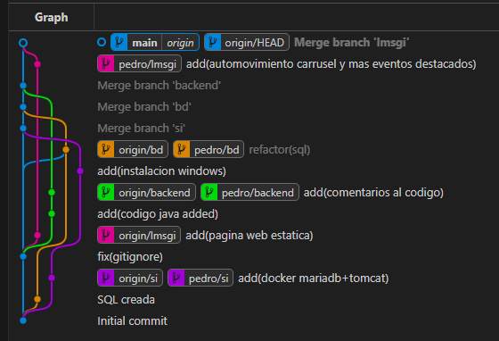
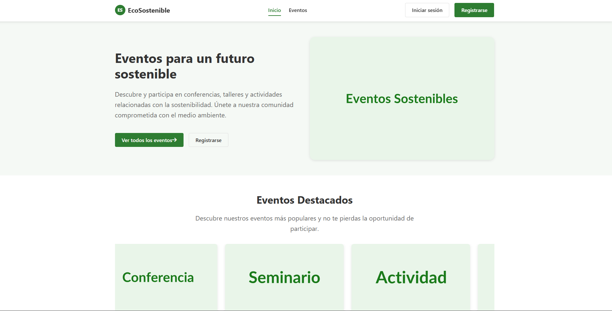

# Prácticas Indra 🌱

## ✨ Introducción ✨

*EcoSostenible* es una plataforma de prácticas desarrollada por Indra, que simula un entorno real de gestión y visualización de eventos sostenibles. Este proyecto integra un robusto backend en Java, una base de datos relacional y una interfaz web moderna, permitiendo experimentar con la organización, inscripción y difusión de actividades enfocadas en la sostenibilidad.

---

## 📁 Estructura de Carpetas y Archivos

### 1. backend/  
- **pom.xml**: Archivo de configuración para Maven *(Java 21, dependencias, build)*.  
- **.gitignore**: Configurado para ignorar carpetas de build, IDEs y archivos temporales.  
- **src/main/java/com/indra/eventossostenibles/**  
    - `Controller.java`: Lógica principal para CRUD, gestión en memoria y mucho más. 🚀  
    - `Event.java`: Modelo del evento (*record* en Java).  
    - `Inscription.java`: Modelo para inscripción en eventos.  
    - `Location.java`: Modelo de localización de eventos.  
    - `User.java`: Modelo del usuario.  
- **src/test/java/com/indra/eventossostenibles/**  
    - `ControllerTest.java`: Pruebas unitarias con JUnit para validar toda la lógica del controlador.  
- **target/**: Carpeta con archivos compilados y clases generadas por Maven.

### 2. html/  
- **index.html**: Página principal, donde se destaca la presentación y eventos estrella. ⭐  
- **eventos.html**: Listado interactivo de eventos con filtros y búsqueda. 🔍  
- **detalle_evento.html**: Detalles del evento con opción a inscripción y datos del organizador. 💡  
- **scripts/**  
    - `main.js`: Lógica común para modales de login/registro, creación de eventos y gestión de usuarios, incluso utilizando localStorage.  
    - `index.js`: Carousel para destacar eventos en la home.  
    - `eventos.js`: Implementa filtros y renderizado dinámico para una experiencia única.  
    - `detalle_evento.js`: Maneja la carga dinámica de detalles, inscripciones simuladas y opciones para compartir.  
- **styles/**  
    - `styles.css`: Estilos modernos y responsivos que hacen brillar toda la web. 🎨

### 3. sql/  
- **BD_eventoSostenible.sql**: Script SQL para crear la base de datos con tablas para usuarios, eventos, inscripciones, localizaciones, categorías, y relaciones entre organizadores y eventos.

### 4. doc/  
- **compose.yml**: Configuración de Docker Compose para levantar MariaDB y Tomcat de manera sencilla.  
- **Instalacion windows 10.pdf**: Guía detallada para instalar dependencias y configurar el entorno en Windows 10.

### 5. Archivos adicionales  
- **grafo_ramas_git.jpg**: Imagen ilustrativa del grafo de ramas de Git.  
- **portal_eventos_sostenibles.jpg**: Imagen que muestra el atractivo portal de eventos.

---

## 📸 Imágenes del Proyecto

### Grafo de ramas de Git  


### Vista previa del portal  


---

## 📚 Tutorial de Utilización

### Requisitos previos
- **Java 21**
- **Maven**
- **Docker** (opcional, ¡recomendado para una experiencia completa!)  
- Un navegador web moderno como *Chrome* o *Firefox*.

### 1. Backend (Java)
1. Navega hasta la carpeta `backend`.  
2. Compila y ejecuta los tests:
     ```powershell
     mvn clean test
     ```
3. (Opcional) Empaqueta el proyecto:
     ```powershell
     mvn package
     ```
4. El backend está listo para conectarse a una base de datos relacional. *(Consulta la sección SQL y Docker)*.

### 2. Base de datos
- Ejecuta el script `sql/BD_eventoSostenible.sql` en MariaDB/MySQL.  
- O utiliza Docker Compose:
     ```powershell
     cd doc
     docker compose up -d
     ```
- Configura las variables de entorno según el archivo `compose.yml`.

### 3. Frontend (Web)
- Abre el archivo `html/index.html` en tu navegador y disfruta de la experiencia interactiva.  
- Navega entre eventos, visualiza detalles, filtra resultados y simula inscripciones.

### 4. Pruebas
Ejecuta las pruebas unitarias ubicadas en `backend/src/test/java/com/indra/eventossostenibles/ControllerTest.java` utilizando Maven.

### 5. Documentación y recursos
- Revisa el *manual de instalación* `doc/Instalacion windows 10.pdf` para una guía completa.  
- Consulta las imágenes para apreciar el grafo de ramas de Git y la vista previa del portal.

---

## 🔍 Explicación de cada apartado

### Backend
- **Controller.java**: Gestiona usuarios, eventos e inscripciones en memoria. Incluye métodos CRUD, búsquedas y validaciones.
- **Event.java, User.java, Inscription.java, Location.java**: Modelos de datos usando *records* para mayor claridad y concisión.
- **ControllerTest.java**: Asegura la robustez del controlador mediante pruebas unitarias exhaustivas.

### Frontend
- **index.html, eventos.html, detalle_evento.html**: Páginas clave para la navegación e interacción del portal.
- **scripts/**: Encargados de la lógica interactiva, gestión de modales y simulación de inscripciones.
- **styles/**: Hacen que la interfaz luzca moderna, responsiva y atractiva.

### SQL
- **BD_eventoSostenible.sql**: Define la estructura y relaciones necesarias en la base de datos.

### doc/
- **compose.yml**: Facilita el arranque de la base de datos y Tomcat mediante Docker.
- **Instalacion windows 10.pdf**: Instrucciones detalladas para instalar y configurar el entorno.

### Recursos gráficos
- **grafo_ramas_git.jpg**: Visualiza la estructura de ramas del repositorio Git.  
- **portal_eventos_sostenibles.jpg**: Representa el atractivo diseño del portal web.

---

## ⚡ Notas finales
- El frontend es *estático* y simula la lógica del backend. Para una integración real, adapta el backend Java para exponer una API REST y conecta el frontend.
- El proyecto es modular y fácilmente ampliable.
- Para cualquier duda, revisa los comentarios en el código y la documentación incluida.

¡Disfruta de una experiencia interactiva y visualmente atractiva con ProyectoIndra! 🚀
